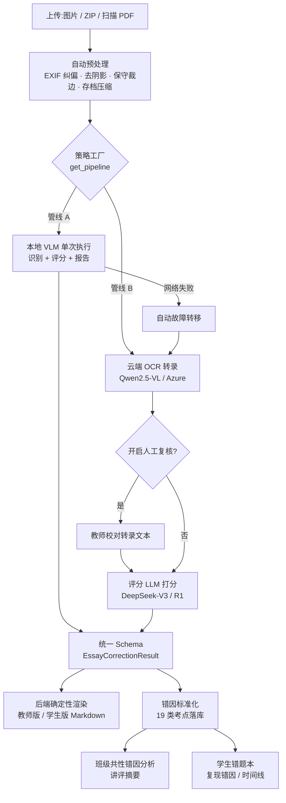
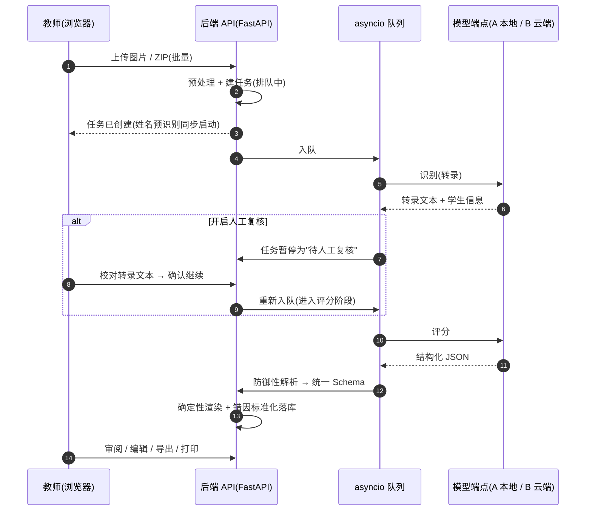

# 德语教师端智能作文批改系统


> **教师用户请看这里:** 不懂电脑也能上手的图文步骤手册 → [使用手册.md](使用手册.md)
> 日常使用只需三个文件:首次安装.bat(仅一次)、一键启动.bat、一键停止.bat。

面向中国高中德语教师的作文批改生产力工具:批量上传手写作文图片,自动识别、评分并生成结构化批改报告;
批改数据进一步聚合为**班级共性错因分析**与**学生错题本**,形成"批改 → 讲评 → 错题追踪"的完整教学闭环。

- 目标学生:备考 **高考德语**、**DSD I / DSD II** 的 A1–B2 学习者
- 核心架构:双管线热切换(Strategy Pattern)—— 无论走哪条管线,输出数据结构与界面渲染完全统一
- 教师配置:管线选择、评分标准(高考 25 分制 / DSD)、三档批改细致度、可选的 OCR 人工复核

---

## 目录

- [项目定位](#项目定位)
- [核心特性](#核心特性)
- [系统架构与工作流程](#系统架构与工作流程)
- [技术栈](#技术栈)
- [目录结构](#目录结构)
- [快速开始](#快速开始)
- [离线自包含运行与分发](#离线自包含运行与分发)
- [配置说明](#配置说明)
- [统一设置中心与数据加密](#统一设置中心与数据加密)
- [数据存储与隐私](#数据存储与隐私)
- [API 概览](#api-概览)
- [使用流程(教师端)](#使用流程教师端)
- [数据库与迁移](#数据库与迁移)
- [测试](#测试)
- [故障排查](#故障排查)
- [常见问题 FAQ](#常见问题-faq)
- [开发与扩展指南](#开发与扩展指南)
- [路线图](#路线图)
- [版本与里程碑](#版本与里程碑)
- [界面预览](#界面预览)
- [许可证与致谢](#许可证与致谢)

---

## 项目定位

这不是一个"云端 SaaS",而是一台**归教师/学校所有的本地批改工作站**:

- **数据主权**:默认管线(管线 A)全部推理在本机/校内完成,作文照片不出校园;
- **开箱即用**:内置便携 Python 运行时与前端构建产物,新电脑双击即用,无需安装 Python/Node.js;
- **教学闭环**:不止打分——错因标准化(19 类考点)、班级讲评摘要、学生错题本、练习卷生成环环相扣;
- **可扩展**:双管线均为策略模式实现,新增模型/管线不改动输出契约与前端。

按你的身份选择阅读路径:

| 你是 | 推荐先读 | 然后 |
|---|---|---|
| 教师(日常使用) | [使用手册.md](使用手册.md) | [使用流程(教师端)](#使用流程教师端)、[常见问题 FAQ](#常见问题-faq) |
| 部署/管理员 | [离线自包含运行与分发](#离线自包含运行与分发) | [配置说明](#配置说明)、[故障排查](#故障排查) |
| 开发者 | [系统架构与工作流程](#系统架构与工作流程) | [目录结构](#目录结构)、[开发与扩展指南](#开发与扩展指南)、[测试](#测试) |

---

## 核心特性

### 核心批改能力

| 功能 | 作用 / 适用场景 | 使用要点 |
|---|---|---|
| 双管线热切换 | 管线 A(本地 VLM 单次执行,零成本/高隐私)/ 管线 B(云端 OCR + DeepSeek 两段式,高精度) | 工作台顶部随时切换;默认管线可在设置中心修改 |
| 批量异步批改 | 单篇(多页=一份作文)/ 批量(每张=一篇,支持 ZIP);asyncio 并发队列 | 并发数由 `MAX_CONCURRENT_TASKS` 控制(默认 2) |
| OCR 人工复核 | 识别完成后暂停在"待复核"状态,教师校对转录文本后继续评分(Human-in-the-Loop) | 任选管线均可开启;两管线仅后端模型不同 |
| 自动故障转移 | 管线 A 网络失败时自动切换至管线 B,报告中标注"已转移" | `ALLOW_AUTO_FALLBACK` 默认开启;仅网络类错误触发 |
| 图片预处理 | 上传自动执行 EXIF 纠偏、对比度增强、保守裁边(可开关) | `IMAGE_PREPROCESS` 默认开启,不改变构图 |
| 标准答题卷 | 内置可打印模板(四角定位块+拼音姓名/学号框);上传自动找平与透视校正 | 仅标准卷命中时生效,普通照片不受影响 |
| 续写纸自动并页 | 内置续写纸模板(页底类型带定位点与首页区分);批量上传时续写页自动并入上一张的同一任务 | 首张续写/未命中标记安全回退 |
| 上传后姓名预识别 | 提交后后台即刻识别姓名/学号(已配置端点优先、本地 RapidOCR 完全离线兜底),队列/审阅页即时显示 | 失败静默不阻塞批改;独立轻量队列 |
| 强制性姓名识别 | 设置开启后,工作台选择/拖拽文件(含 ZIP/PDF)的瞬间即用本地引擎识别姓名/年龄并直接显示在文件列表 | 不落盘、不建任务;与"上传后姓名预识别"互补;默认关闭 |
| 二维码识别与绑定卷 | 标准答题卷可绑定学生打印其身份二维码(16mm,本地生成);上传时优先本地扫码直出姓名/学号 | 百毫秒内直出;未扫到自动回退定位点裁剪+本地识别链;旧版空白卷完全兼容 |
| 纯本地 OCR 模式 | 设置中开启后管线 B 的识别(OCR)完全本地化(RapidOCR 离线 CPU,不调用任何云端/远程 OCR 端点) | 姓名区依定位点裁剪;评分与报告链路不变 |
| 手写样本模型 | 花名册内采集学生手写样本(句库素材+抄写卡打印),本地构建特征签名库;预识别分轻量/中等/最精确三档增强 | 本机配置自动推荐,手动优先 |
| 全局等待态 | AppShell 顶部实时状态条:批改/预识别/压缩/训练真实百分比与 ETA,附后台真实自检短语 | 数据库/存储/磁盘/引擎状态一览 |
| UI 外观档位 | 均衡(默认)/极简(灰阶去色、零动效、无阴影、保留低饱和语义色)/高级(页面淡入、光影与悬停质感)三档 | 同一套 Token 派生;顶栏快捷切换即时生效并持久化 |
| 崩溃恢复 | 服务重启后自动回收中断任务重新入队(孤儿任务自愈) | 仅重置 `PROCESSING` 状态;复核中/已完成不受影响 |

### 教学闭环能力(第二期)

| 功能 | 作用 / 适用场景 | 使用要点 |
|---|---|---|
| 错因分类标准化 | LLM 输出的错误类型自动归一到 19 类固定考点(动词位序/名词变格/介词搭配…),保证统计数据可靠 | 渲染前统一归一化,中/英/德别名自动映射 |
| 班级共性错因分析 | 按班级/批次/日期聚合错因,自动生成**讲评摘要**(高频错因 Top N + 典型错例 + 讲评建议顺序 + 得分分布) | 入口:「班级管理 → 共性错因分析」;摘要可复制/下载 |
| 学生错题本 | 学生画像:错因分布、**复现错因高亮**(同一考点反复出错)、批改时间线(可跳转报告)、平均分 | 批改完成后自动建档;按学号检索最稳 |
| 评分与作业管理 | 班级实体(可现场新建)、作业名称、作文题目元数据 | 任务支持按班级/状态/日期筛选 |
| 教师版/学生版双报告 | 教师版全量分析;学生版"订正单"弱化分数、聚焦订正清单与练习建议 | 审阅页一键切换;学生版显示项可定制 |
| 批量操作与导出 | 队列多选批量重试/删除(含文件清理);导出报告 ZIP、成绩表 CSV | CSV 带 UTF-8 BOM,Excel 直接打开 |
| 打印 | 报告(教师版/学生版)支持 A4 打印样式 | 审阅页一键打印,渲染即最终纸面效果 |

### 系统与体验能力

| 功能 | 作用 / 适用场景 | 使用要点 |
|---|---|---|
| 离线自包含运行 | 内置 `runtime/python` 便携运行时与前端构建产物,新电脑零安装即可双击「一键启动」运行 | 「一键自检.bat」一键校验环境完整性(即 `backend/scripts/selfcheck.py`) |
| 统一设置中心 | 运行配置全量可视可改(写回 `backend/.env` 并热生效) | 含演示/开发模式、管线连通性测试、提示词微调、探索项「恢复默认 / 一键回退」;默认仅本机可访问 |
| 学生数据加密(可选) | AES-256-GCM 存储层透明加解密(姓名/学号确定性加密,结果/报告/错因随机加密) | 存量一键迁移、恢复密钥重置、忘记口令 Plan B 归档重建;重启后需口令解锁,数据接口自动 423 拦截 |
| 作业台账 | 登记项可配置(等级/分值/完成度/星级),全班快速登记、汇总矩阵、明细纠错与预设项目 | 入口:左侧「作业台账」;表格每格显示最近一次登记 |
| 考试统计 | 上传考卷自动逐题识别(听力不纳入),人工修订优先、班级分析报告一键生成与导出 | 独立队列;入口:左侧「考试统计」 |
| 统一统计层 | 作文批改 / 考试 / 台账三源读时聚合——成绩总表(导出 CSV)、分数段分布、综合/考试/进步/覆盖率排行、月度趋势 | 与画像/班级分析全链路联动 |
| 示范学习 | 用一篇示例范文归纳批改风格(评分尺度/语气/修改偏好/表达习惯),自动注入后续批改 | 单一生效;入口:左侧「示范学习」 |
| 重新批改(原地重跑) | 审阅页对已完成任务一键重跑(复用原图,参数可覆盖) | 系统报告覆盖旧版、教师编辑版保留;可追溯重跑次数与新旧对比 |
| 转录原文编辑 | 审阅页「转录原文」区移至原图正下方,教师就地修订后同步重渲染系统报告 | 批注核对按新文本重新定位 |
| 批注核对增强 | 19 类错因「颜色 + 线型」唯一视觉映射(含虚线/加粗/高亮/渐变/锯齿等 9 种线型) | 图例计数筛选、清单↔全文双向联动、Alt+←/→ 导航、悬停预览、一键复制/按类别导出 |
| 上传前图片编辑 | 批量与单篇均可对已选图片做灰度/黑白、拖拽裁剪、旋转与「姓名栏选区」引导 | 支持翻页、撤销与重置原图;仅编辑版落盘 |
| 学生版报告可定制 | 教师寄语可编辑(10 条场景化预设语) | 探索项可切换"学生版显示得分 / 练习重点" |
| 练习卷生成 | 从已批改作业的真实错因(分布/典型错句/主题)生成针对性练习卷 + 标准答案 | 来源多选、题型多选、5~50 题;可导出 .md 与独立打印页 |
| 存档图片压缩 | 上传自动瘦身(长边超限才缩小、仅更小才替换、带压缩标记可安全重跑) | 设置中心「上传与图片处理」可批量压缩存量并查看进度与节省量 |
| 扫描 PDF 上传 | 批量/单篇均支持含图 PDF(逐页转图;ZIP 内同样展开) | 加密/损坏/超页数给出可读错误 |
| 识别可信度机制(OCR 契约 v2) | 零修正硬约束(照抄笔迹,不纠正拼写语法)+ 低质量警示(`recognition_quality`)+ 不确定处标记(`[unleserlich]` 红标 / `[unsicher:猜测]` 黄标) | 评分侧不据此扣分;批改后醒目提示人工核对 |
| 班级合并 | 任务/错因/花名册/台账/考试整体并入目标班级 | 同名成员「补全学号→去重→冲突以目标为准」;来源班级标记「已并入」;单事务失败整体回滚 |
| 演示模式(MOCK_MODE) | 无需任何模型端点即可跑通全流程(含人工复核) | 用于界面验收与开发 |
| 数据库迁移(Alembic) | 渐进式 schema 升级,存量数据库自动接入 | 升级不丢数据;启动时自动执行 |
| 运行配置抽屉 | 展示管线就绪状态、模型名、演示模式等实时配置 | 顶栏入口 |
| 内置使用指南 | 左侧导航「使用指南」逐模块说明全部功能(作用/场景/步骤/参数/注意事项) | 支持关键字搜索与目录跳转 |
| 统一 UI 规范 | 全站设计 Token 收敛于 `src/theme.ts`,页面标题统一 PageHeader | 新增页面前请阅读 [docs/UI规范.md](docs/UI规范.md) |
| 响应式布局 / 明暗主题 | 桌面常驻导航、小屏抽屉(断点 900px);Material Design 明/暗切换 | 顶栏切换,偏好本地持久化 |

---

## 系统架构与工作流程

### 端到端流程(Mermaid)



> 说明:管线 A 同样支持"识别 → [人工复核] → 评分"的可复核流程,上图以管线 B 的两段式结构示意;
> 无论走哪条路径,最终都收敛到同一份 `EssayCorrectionResult` 与同一套 Markdown 渲染。

### 请求时序(批量批改 + 人工复核)



### 文字版流程图(等价说明)

```text
[ 前端上传(批量图片 / ZIP) ]
            │
[ 策略工厂 get_pipeline(config) ]
            │
   ┌────────┴───────────────────────────┐
   ▼                                    ▼
管线 A · 本地 VLM                      管线 B · 云端解耦
Qwen3.8-27B(vLLM/Ollama)              ① Qwen2.5-VL / Azure OCR 转录
默认单次:图 → 转录+评分+报告           ② [可选] 教师人工复核转录(两管线通用)
可复核:识别 → [复核] → 评分
零成本 / 数据不出内网                   ③ DeepSeek-V3 / R1 评分
   └────────┬───────────────────────────┘
            ▼
[ 统一 Schema:EssayCorrectionResult ]
            │
[ 后端确定性渲染 Markdown 报告 ]
            │
[ 错因标准化(canonical_type)落库 ]
       ┌────┴─────────────────────┐
       ▼                          ▼
[ 班级共性错因分析 ]          [ 学生错题本 ]
(讲评摘要/分布/典型错例)      (复现错因/时间线/个体分布)
```

### 双管线对比

| 维度 | 管线 A · 本地 VLM | 管线 B · 云端解耦 |
|---|---|---|
| 组成 | 单一视觉语言模型(OpenAI 兼容端点) | ① OCR 转录(视觉模型/Azure) + ② 评分 LLM(DeepSeek) |
| 典型部署 | vLLM / Ollama(默认示例 `Qwen3.8-27B-Q4_K_M`) | 阿里云百炼 DashScope(Qwen2.5-VL)+ DeepSeek 开放平台 |
| 成本 | 一次性硬件投入,推理零费用 | 按量计费(识别 + 评分两次调用) |
| 隐私 | 数据不出内网 | 作文图片与文字会发送至云服务商处理 |
| 速度 | 受本机算力限制(单篇可能数分钟) | 取决于网络与云端负载 |
| 适用场景 | 学校已部署本地模型;日常批改 | 需要更高识别/评分精度;重要考试 |
| 失败行为 | 网络失败可自动转移至管线 B(报告标注“已转移”) | 无转移(可重试) |
| 人工复核 | 支持 | 支持(推荐开启) |

> 选型速查(引自使用手册):两个都有 → 平时用 A 省钱、重要考试用 B;都不确定 → 先用演示模式熟悉界面。

### 关键设计取舍

- `markdown_report` 由后端渲染器确定性生成,LLM 只产出结构化 JSON —— 保证双管线输出 100% 一致,前端零适配;
- 所有错误条目在渲染前经 `error_taxonomy` 归一化(中/英/德别名 → 19 类考点),分析统计永不碎片化;
- 管线 A 网络失败/超时时,可选自动故障转移至管线 B(记录警告日志与 `fallback_triggered` 标记);
- 所有 LLM 输出经过防御性解析(剥代码块围栏、花括号截取、尾随逗号清洗、一次修复重试);
- 队列为进程内 asyncio 工作池 + SQLite 单文件库:单机零运维、可整目录搬迁,契合"教师工作站"定位;
- OCR 契约 v2:识别"照抄笔迹、零修正",低质量给警示、不确定处打标,**不在识别环节替教师做判断**;
- 加密为存储层透明加解密:业务代码零感知,锁定态对数据接口统一返回 423,解锁入口始终可达。

---

## 技术栈

| 层 | 技术 | 版本(声明) | 用途 |
|---|---|---|---|
| 后端框架 | FastAPI + Uvicorn | ≥0.115 / ≥0.32 | HTTP API 与 ASGI 服务 |
| 配置与校验 | Pydantic + pydantic-settings | ≥2.9 / ≥2.6 | 请求/响应 Schema、`.env` 配置加载 |
| HTTP 客户端 | httpx | ≥0.27 | 调用 LLM / OCR 端点(多模态) |
| 数据库 | SQLAlchemy(async)+ aiosqlite + Alembic | ≥2.0.36 / ≥0.20 / ≥1.14 | 异步 ORM、SQLite 驱动、迁移 |
| 文件与图像 | aiofiles + Pillow + numpy | ≥24.1 / ≥11.0 / ≥1.26 | 上传落盘、图像预处理(去阴影背景估计) |
| 可选图像组件 | pillow-heif / rapidocr_onnxruntime / qrcode | ≥0.18 / ≥1.2 / ≥7.4 | HEIC 解码、本地离线 OCR、学生二维码生成 |
| PDF | pypdfium2 | ≥4.30 | 扫描 PDF 逐页转图 |
| 安全 | cryptography | ≥43.0 | AES-256-GCM/SIV、scrypt 口令派生 |
| 测试 | pytest + pytest-asyncio | ≥8.3 / ≥0.24 | 后端单元/回归测试 |
| 前端框架 | React + react-router-dom | 18.3 / 6.28 | SPA 页面与路由 |
| UI 组件 | MUI(Material)+ MUI X Charts | 6.1 / 7.29 | 组件库、统计图表 |
| Markdown 渲染 | react-markdown + remark-gfm | 9.0 / 4.0 | 批改报告展示 |
| 图像交互 | react-zoom-pan-pinch + browser-image-compression | 3.6 / 2.0 | 原图缩放拖动、客户端压缩 |
| 构建 | Vite + TypeScript | 6.0 / 5.6 | 开发服务器与生产构建 |
| 数据库文件 | SQLite(单文件,`backend/data/corrector.db`) | — | 免安装、可整目录迁移 |
| 模型服务 | 本地 vLLM / Ollama;云端 DashScope(Qwen2.5-VL)、DeepSeek-V3 / R1、Azure OCR(可选) | — | 双管线推理后端 |
| 便携运行时 | CPython 便携版(`runtime/python`) | 3.14(随包) | 离线自包含运行;开发环境要求 Python 3.11+ |

---

## 目录结构

```text
批改器/
├─ 一键启动.bat / 一键停止.bat / 一键自检.bat      # Windows 日常三件套
├─ 首次安装.bat                                   # 首次联网安装(未内置 runtime 时的回退路径)
├─ 备份数据.bat / 恢复数据.bat                     # 数据备份与恢复(交互式)
├─ 应急启动.bat / 应急配置.env(.example)           # 应急版:内置云端配置一键启动
├─ 一键启动.command 等 .command 脚本               # macOS 对应脚本(含"首次制作mac运行环境.command")
├─ 使用手册.md                                    # 面向教师的图文手册(16 章)
├─ backend/
│  ├─ app/
│  │  ├─ main.py             # FastAPI 入口:路由注册 / CORS / 前端静态托管(SPA 回退)
│  │  ├─ config.py           # pydantic-settings 全局配置(与 .env 键一一对应)
│  │  ├─ api/                # 16 个路由模块 + deps.py(加密解锁守卫 require_unlocked)
│  │  ├─ models/
│  │  │  ├─ schemas.py       # 统一 Schema(唯一输出契约 EssayCorrectionResult)
│  │  │  ├─ db_models.py     # ORM:16 张表(任务/班级/学生/错因/台账/考试/…)
│  │  │  └─ encrypted_types.py  # 加密列类型(透明加解密)
│  │  ├─ db/database.py      # 异步引擎 + 自动迁移(含存量库 stamp)
│  │  ├─ pipelines/          # 策略模式:base / local_vlm / cloud_decoupled / mock / factory / prompts
│  │  └─ services/           # 39 个服务模块,重点:
│  │     ├─ correction_service.py   # 任务编排 + A→B 故障转移 + 孤儿任务恢复
│  │     ├─ queue_service.py        # asyncio 并发工作池
│  │     ├─ ocr_client.py / ocr_anomaly.py      # OCR 适配器 / 转录异常检测与自愈
│  │     ├─ llm_client.py / llm_params.py       # LLM 客户端 / 超三态与自动适配
│  │     ├─ parser.py / report_renderer.py      # 防御性解析 / 确定性渲染
│  │     ├─ error_taxonomy.py       # 19 类错因标准化 + 别名映射 + 练习建议库
│  │     ├─ image_preprocess.py / image_compress.py / sheet_align.py / pdf_expand.py
│  │     ├─ name_pre_ocr.py / qr_identity.py / handwriting_service.py / student_assignment.py
│  │     ├─ analytics_service.py / statistics_service.py / student_service.py
│  │     ├─ ledger_service.py / exam_service.py / practice_service.py / style_learning_service.py
│  │     ├─ class_merge_service.py / class_package_service.py / demo_data_service.py
│  │     ├─ encryption_service.py / crypto_service.py / env_manager.py
│  │     └─ settings_service.py / prompt_overrides.py / status_service.py / audit_service.py …
│  ├─ migrations/            # Alembic 迁移脚本(12 个版本)
│  ├─ scripts/               # backup.py / restore.py / selfcheck.py / diag_vision.py / setup_macos_runtime.py
│  ├─ tests/                 # pytest:45 个测试文件、469 个测试用例
│  ├─ alembic.ini / pytest.ini / requirements.txt / manifest.txt
│  └─ data/                  # 运行时生成(数据库 + uploads,不入版本库)
├─ frontend/
│  ├─ src/
│  │  ├─ main.tsx / App.tsx  # 主题(明/暗)+ 布局外壳 + 路由(含独立打印页)
│  │  ├─ theme.ts            # 设计 Token 与三档 UI 派生(唯一主题源)
│  │  ├─ print.css           # 报告打印样式(A4)
│  │  ├─ api/client.ts       # axios 封装(含 Blob 导出与错误提取)
│  │  ├─ types/index.ts      # 与 Pydantic 逐字段对齐的 TS 类型
│  │  ├─ components/         # AppShell / SettingsDialog / MarkdownReport / AnnotationPanel /
│  │  │                      # TranscriptPanel / StatusChip / SystemStatusBar / ImageEditorDialog /
│  │  │                      # StartupDataDialog / classes/* / settings/* …
│  │  └─ pages/              # 20 个页面:工作台/审阅/队列/班级管理/错题本/台账/考试/统计/
│  │                         # 示范学习/练习卷/使用指南 + 打印页(报告/答题卷/续写纸/抄写卡/练习)
│  └─ index.html / vite.config.ts / package.json(dev 代理 /api → 8765)
├─ docs/                     # UI规范 · 提示词模式对照 · Spec完成度对照 · macOS指南 · 界面截图
├─ .qoder/                   # 项目级 AI 资产:skills(开发+操作指南)/ agents(管线开发/数据运维)
├─ .cursorrules              # 项目完整规格(供 IDE 内 AI 遵循)
└─ runtime/                  # 便携运行时(体积大,不入版本库;分发靠文件夹拷贝)
```

---

## 快速开始

### 四条使用路径总览

| 方式 | 适合谁 | 入口 | 是否需要网络 |
|---|---|---|---|
| 开箱即用(离线自包含) | 教师日常使用 | 双击「一键启动.bat / 一键启动.command」 | 除云端管线外,无需联网 |
| 应急版 | 未部署任何模型端点的临时使用 | 双击「应急启动.bat / 应急启动.command」 | 需要(使用内置云端配置) |
| 开发者模式 | 二次开发/调试 | 下方命令(venv + npm) | 首次装依赖需要 |
| 演示模式 | 界面验收/教学演示 | `MOCK_MODE=true` 后正常启动 | 不需要 |

### 开发者模式:后端

Windows(PowerShell):

```powershell
cd backend
python -m venv .venv
.venv\Scripts\pip install -r requirements.txt
copy .env.example .env          # 首次配置(无真实模型时设 MOCK_MODE=true)
.venv\Scripts\python -m uvicorn app.main:app --host 127.0.0.1 --port 8765 --reload
```

macOS / Linux 等价命令:

```bash
cd backend
python3 -m venv .venv
source .venv/bin/activate
pip install -r requirements.txt
cp .env.example .env
python -m uvicorn app.main:app --host 127.0.0.1 --port 8765 --reload
```

> 首次启动会自动执行数据库迁移(Alembic `upgrade head`);旧版本数据库会被自动识别并标记基线版本,历史数据保留。

### 开发者模式:前端

```powershell
cd frontend
npm install
npm run dev                     # http://localhost:5173(Vite 代理 /api → 8765)
```

构建生产产物(由后端 8765 直接托管,运行时无需 Node):

```bash
cd frontend
npm run build                   # 产物输出到 frontend/dist
```

### 演示模式(无需任何模型端点)

在 `backend/.env` 中设置 `MOCK_MODE=true`,即可用样例数据跑通**完整流程**
(含人工复核、班级分析、错题本),用于界面验收与开发调试。

> 演示模式启动后界面顶部会常驻黄色提示条;要正式使用请按[配置说明](#配置说明)接入真实模型。

---

## 离线自包含运行与分发

> 目标:在一台**全新电脑、不安装任何依赖**的前提下直接启动运行。

### 依赖构成(全部位于项目目录内)

| 依赖 | 存放位置 | 说明 |
|---|---|---|
| Python 解释器 + 后端依赖 | `runtime/python/` | 便携式 CPython(开发机 Python 安装目录复制 + `pip install -r backend/requirements.txt`) |
| 前端 Node 依赖与构建产物 | `frontend/node_modules/`、`frontend/dist/` | 运行时无需 Node:后端直接托管 `dist`(端口 8765);`node_modules` 仅开发/重新构建时使用 |
| 数据库与迁移 | `backend/data/corrector.db`、`backend/migrations/` | 首次启动自动创建并执行迁移 |
| 离线脚本 | `一键启动.bat` / `一键停止.bat` / `首次安装.bat` / `一键自检.bat` | GBK 编码 + CRLF,兼容 cmd |

### 首次启动流程(新电脑)

1. 把整个项目文件夹拷贝到新电脑(建议路径不含太多层级,如 `D:\批改器`);
2. 双击「**一键自检.bat**」:确认运行时/依赖/前端产物/数据库迁移版本全部 OK;
3. 双击「**一键启动.bat**」:自动启动服务并打开浏览器(默认 `http://127.0.0.1:8765`;端口被占用时自动改用 8766,以提示窗口为准);
4. 使用完毕双击「**一键停止.bat**」。

### 打包/更新方式(回到有网开发机)

- 更新后端依赖:`runtime\python\python.exe -m pip install -r backend\requirements.txt`;
- 重新构建前端:在 `frontend` 目录执行 `npm install && npm run build`,把新的 `dist` 一并拷贝;
- 「首次安装.bat」在未内置 `runtime` 时仍保留联网安装回退路径(需 Python 3.11+ 与 Node.js)。

### 纯净新电脑验证清单(部署验收,全程可断网)

- [x] 双击「一键自检.bat」:全部 [OK] —— 含必检 13 项依赖(含密码学/上传组件)、VC++ 运行库随包检查、端口占用信息项;
- [x] 双击「一键启动.bat」:浏览器自动打开(默认 8765;被占用自动切换 8766);
- [x] 上传一张照片完成一次批改 → 审阅导出;「一键停止」后再启动,数据仍在;
- [x] 把文件夹放到含中文或空格的路径,重复第 1-2 步;
- [x] 拷到 U 盘再拷到另一台电脑,直接启动成功,即视为便携性验收通过。

(细则与判定标准另见《使用手册》第十五章。)

### 放置位置与分发注意

- 放在**用户可写**位置(桌面 / 文档 / 非系统盘);不要放 `C:\Program Files`、ProgramData、只读共享或写保护 U 盘(自检会提示"上传目录不可写");
- 网络分发(网盘/邮件)得到的 ZIP 可能被标记"来自 Internet":若系统提示"未知发布者",右键文件 → 属性 → 勾选"解除锁定"后再解压;
- 端口:默认 8765,被占用自动切换 8766(启动与停止脚本均覆盖两个端口);
- 系统要求:Windows 10/11(64 位);无需安装 Python / Node.js,除云端管线外无需联网。

### macOS 便携版

与 Windows 完全对等(同一代码/界面/数据格式):

1. 首次双击「**首次制作mac运行环境.command**」(联网一次,自动识别 Apple 芯片/Intel 并下载运行时);
2. 之后仅需「一键启动.command / 一键停止.command / 一键自检.command」,离线自包含;
3. Gatekeeper 提示"无法验证开发者"时:右键脚本 → **打开** → 再点"打开"(仅需一次),或终端执行
   `xattr -dr com.apple.quarantine /路径/批改器`;
4. 制作、分发与双平台数据互导说明见 [docs/macOS便携版制作与使用.md](docs/macOS便携版制作与使用.md)。

### 应急版(内置云端配置的一键启动)

Windows「应急启动.bat」/ macOS「应急启动.command」双击即可使用内置的百炼 Qwen 识别 + DeepSeek 评分配置(供教师未自行部署端点时应急)。

- 云端预设存于根目录 `应急配置.env`(明文,已在 .gitignore;模板见 `应急配置.env.example`),以**进程环境变量**方式注入;
- 不写 `backend/.env`、不影响设置中心与常规配置;与常规版同代码同库,**请勿同时启动两个版本**。

---

## 配置说明

全部配置项均可在**设置中心图形化修改**(写回 `backend/.env` 并热生效);下表为关键项速查,
完整清单(150 行,含逐项注释)见 [backend/.env.example](backend/.env.example)。

### 全局开关

| 键 | 含义 | 默认值 | 必填 |
|---|---|---|---|
| `DEFAULT_PIPELINE` | 默认管线:`PIPELINE_A_LOCAL` / `PIPELINE_B_CLOUD` | `PIPELINE_A_LOCAL` | 否 |
| `ALLOW_AUTO_FALLBACK` | 管线 A 网络失败时自动切 B | `true` | 否 |
| `MOCK_MODE` | 演示模式(不调用任何真实模型) | `false` | 否 |

### 管线 A:本地 VLM

| 键 | 含义 | 默认值 | 必填 |
|---|---|---|---|
| `LOCAL_VLM_BASE_URL` | OpenAI 兼容端点(vLLM 示例 `:8000/v1`;Ollama 示例 `:11434/v1`) | `http://127.0.0.1:8000/v1` | 用管线 A 时必填 |
| `LOCAL_VLM_API_KEY` | 本地端点密钥(本地常见占位值) | `sk-local` | 否 |
| `LOCAL_VLM_MODEL` | 模型名 | `/models/Qwen3.8-27B-Q4_K_M` | 用管线 A 时必填 |
| `LOCAL_VLM_TIMEOUT` | 单次请求超时(秒,本地推理较慢) | `600` | 否 |

### 管线 B 步骤 1:识别 / OCR

| 键 | 含义 | 默认值 | 必填 |
|---|---|---|---|
| `LOCAL_OCR_ONLY` | 纯本地 OCR 模式:识别完全本地化(RapidOCR 离线 CPU) | `false` | 否 |
| `OCR_PROVIDER` | `vlm_openai`(Qwen2.5-VL 等)或 `azure` | `vlm_openai` | 否 |
| `OCR_BASE_URL` | 识别端点(百炼兼容模式示例已内置) | DashScope 兼容地址 | 用管线 B 时必填 |
| `OCR_API_KEY` | 识别服务密钥(用途:云端认字) | 空 | 用管线 B 时必填(纯本地 OCR 模式除外) |
| `OCR_MODEL` | 识别模型名 | `qwen2.5-vl-72b-instruct` | 否 |
| `OCR_TIMEOUT` | 识别超时(秒) | `120` | 否 |
| `AZURE_OCR_ENDPOINT` / `AZURE_OCR_KEY` | Azure Computer Vision 模式专用 | 空 | 仅 `azure` 模式必填 |

### 管线 B 步骤 3:文本评分(DeepSeek)

| 键 | 含义 | 默认值 | 必填 |
|---|---|---|---|
| `DEEPSEEK_BASE_URL` | 评分服务地址 | `https://api.deepseek.com/v1` | 用管线 B 时必填 |
| `DEEPSEEK_API_KEY` | 评分服务密钥(用途:打分) | 空 | 用管线 B 时必填 |
| `DEEPSEEK_MODEL` | 常规评分模型 | `deepseek-chat` | 否 |
| `DEEPSEEK_REASONING_MODEL` | 深度推理模型 | `deepseek-reasoner` | 否 |
| `DEEPSEEK_USE_REASONING` | 是否使用推理模型评分 | `false` | 否 |
| `DEEPSEEK_TIMEOUT` | 评分超时(秒) | `180` | 否 |

### 队列、存储与上传

| 键 | 含义 | 默认值 | 必填 |
|---|---|---|---|
| `MAX_CONCURRENT_TASKS` | 并发批改数 | `2` | 否 |
| `DATABASE_URL` | 数据库连接(默认 SQLite,升级自动迁移) | `sqlite+aiosqlite:///./data/corrector.db` | 否 |
| `UPLOAD_DIR` | 上传文件存储目录 | `./data/uploads` | 否 |
| `SERVER_PORT` | 服务监听端口 | `8765` | 否 |
| `MAX_BATCH_FILES` | 单次上传文件数上限(含 ZIP 展开条目) | `200` | 否 |
| `MAX_UPLOAD_TOTAL_MB` | 单次请求上传总量上限(MB,含 ZIP 包本身) | `500` | 否 |

### 图像与识别增强

| 键 | 含义 | 默认值 | 必填 |
|---|---|---|---|
| `IMAGE_PREPROCESS` | 上传自动预处理(EXIF 纠偏/增强/保守裁边) | `true` | 否 |
| `IMAGE_SHADOW_REMOVAL` | 去阴影/光照均衡 | `true` | 否 |
| `IMAGE_GRAYSCALE` | 灰度化(黑白打印稿可开) | `false` | 否 |
| `IMAGE_COMPRESS_ENABLED` / `IMAGE_COMPRESS_MAX_SIDE` / `IMAGE_COMPRESS_QUALITY` | 存档图片压缩(开关/长边上限/质量) | `true` / `2200` / `88` | 否 |
| `SHEET_ALIGN_ENABLED` | 标准答题卷自动找平 | `true` | 否 |
| `NAME_PRE_OCR_ENABLED` | 上传后姓名预识别 | `true` | 否 |
| `FORCE_NAME_RECOGNITION` | 强制性姓名识别(选文件即识) | `false` | 否 |
| `HANDWRITING_OCR_LEVEL` | 手写识别增强档位:`auto` / `light` / `medium` / `precise` | `auto` | 否 |
| `UI_PROFILE` | 界面外观档位:`balanced` / `efficiency` / `premium` | `balanced` | 否 |
| `OCR_ANOMALY_ENABLED` / `_THRESHOLD` / `_MAX_RETRY` / `_FORCE_REVIEW` | OCR 异常检测与自愈(开关/阈值/重试预算/重试用尽强制复核) | `true` / `4` / `1` / `true` | 否 |

### 教学口径与报告

| 键 | 含义 | 默认值 | 必填 |
|---|---|---|---|
| `SCORE_PASS_LINE` | 及格线(0~100,统计/考试共用口径) | `60` | 否 |
| `DEFAULT_GRADING_STANDARD` | 工作台默认评分标准 | `GAOKAO` | 否 |
| `DEFAULT_DETAIL_LEVEL` | 工作台默认细致度 | `MEDIUM` | 否 |
| `STUDENT_REPORT_SHOW_SCORE` / `STUDENT_REPORT_SHOW_TIPS` | 学生版显示得分 / 练习重点 | `false` / `true` | 否 |

### 安全与访问

| 键 | 含义 | 默认值 | 必填 |
|---|---|---|---|
| `SETTINGS_ADMIN_TOKEN` | 设置接口访问令牌;为空时仅本机回环可访问,配置后所有设置请求须携带 `X-Admin-Token` | 空 | 否 |
| `DEV_MODE` | 开发模式:放开"开发者专属"配置项(数据库/目录/端口/并发等) | `false` | 否 |
| `STARTUP_DATA_PICKER` | 启动时弹出「班级数据包选择」对话框 | `true` | 否 |
| `ENCRYPTION_ENABLED` | 学生数据加密总开关(建议通过设置中心向导操作,勿手工修改) | `false` | 否 |
| `DEV_MASTER_ENABLED` / `DEV_MASTER_PASSWORD` | 开发模式万能密码(管理员兜底解锁;需与 `DEV_MODE` 同时开启且为 ≥64 位十六进制 Hash;**仅本地 .env 注入,禁止提交仓库**) | `false` / 空 | 否 |

### 大模型超参数(自动适配)

每个超参数(temperature / top_p / max_tokens / penalties / seed / stop / response_format / stream / 自定义键)
均为**三态取值**:

- `auto` = 自动适配(默认,与历史行为一致);
- `omit` = 不发送该键(而非发送 0/空/null);
- 具体值 = 强制指定。

规则要点:

1. 基线为历史发送集(`temperature=0.2` / `stream=false` / `response_format=json_object`);
2. 可选参数在模型画像未声明时不发送;内置画像(如部分模型不支持 temperature)+ 运行时"400 剔除学习"共同决定最终发送集;
3. 端点返回 `Parameter 'xxx' is not supported` 时自动剔除该参数、重试一次并记录(设置中心"自动适配记录"可查看/清除);
4. `EXTRA_PARAMS` 支持自定义键值(分号分隔,值含英文逗号按数组解析,如 `min_p=0.05;repetition_penalty=1.05`)。

> 命名规律:管线 A 前缀 `LOCAL_VLM_`、识别前缀 `OCR_`、评分前缀 `DEEPSEEK_`,例如
> `LOCAL_VLM_TEMPERATURE` / `OCR_MAX_TOKENS` / `DEEPSEEK_SEED`。

---

## 统一设置中心与数据加密

### 设置中心

- 入口:顶栏齿轮图标打开**窗口式设置中心**(左栏"大范围"导航 × 右栏"小项"列表,支持滚动/关闭);也可在「使用指南」页查看完整说明;
- 注册表驱动(31 项设置)、7 个接口端点(视图/更新/重置/回退/测试/提示词微调/自动适配清理);
- 设置项写回 `backend/.env`(保留注释、原子替换),热字段即时生效,带「需重启」标记的项重启后端生效;
- 敏感值三态编辑:不改 / 清除 / 设置(脱敏回显);
- 范围覆盖:基础运行(含**工作台默认评分标准/细致度**)/ 管线 A / 管线 B 识别 / 管线 B 评分 / 上传与图片处理 / **教学与报告(及格线口径 0~100、学生版显示得分与练习重点)** / 存储与高级(开发者项)/ 安全与访问,以及提示词微调、数据加密、探索性实验项(跨分组聚合,支持恢复默认与一键回退);
- 访问控制:设置接口默认仅本机回环可访问;配置 `SETTINGS_ADMIN_TOKEN` 后所有设置请求必须携带令牌(恒定时比较)。

### 数据加密(可选)

- 机制:AES-256-GCM 存储层透明加解密——姓名/学号确定性加密(支持检索匹配),结果/报告/错因随机加密;口令经 scrypt 派生;
- 建议流程:设置口令 → 生成恢复密钥(离线保存)→ 加密存量数据;
- 忘记口令:可用恢复密钥重置(强制轮换密钥);或走 Plan B(归档密文副本后清空重建);
- 锁定行为:重启后需口令解锁,数据接口自动 423 拦截并弹出全局解锁窗;系统/设置/加密类接口不受锁定限制(解锁入口必须可达);
- 关闭加密:反向迁移回明文存储(设置中心向导操作)。

> ⚠️ 恢复密钥请离线保存(打印或存入密码管理器),它是忘记口令时唯一能保住密文数据的凭据。

---

## 数据存储与隐私

### 数据在哪里

| 内容 | 位置 | 说明 |
|---|---|---|
| 任务 / 班级 / 学生 / 错因 | `backend/data/corrector.db`(+`-wal`/`-shm`) | SQLite 单文件,含全部业务数据 |
| 答卷原图与中间产物 | `backend/data/uploads/batch_*/`、`task_*/` | 按任务目录归档 |
| 数据库备份包 | `backend/backups/corrector_backup_时间戳.zip` | 含数据库一致性快照 + uploads + manifest.txt |
| 恢复前快照 | `backend/data_beforerestore_时间戳/` | 恢复动作自动保留的原数据 |
| 系统设置与密钥包裹 | `app_settings` 表 | 设置中心配置、提示词附录、加密密钥包裹、超参适配记录 |

### 备份与恢复

- **备份**:双击「备份数据.bat」(= `backend/scripts/backup.py`)——使用 SQLite Online Backup API 生成一致性快照(**运行中也安全**),
  打包数据库 + uploads 为 ZIP;支持 `--keep N` 仅保留最近 N 份;
- **恢复**:双击「恢复数据.bat」(= `backend/scripts/restore.py`)——交互式列出全部备份(含任务数/大小),确认后执行;
  恢复前自动把现有 `data` 改名保留为 `data_beforerestore_时间戳`(防误操作);
- **跨机迁移**:班级数据包(`class_package_*.zip`)支持 Windows ⇄ macOS 双向导入导出;启动时可选择导入数据包或直接进入。

### 隐私设计(本地优先)

1. 管线 A 全链路本地推理,**作文照片不出校园**;管线 B 会把图片/文字发送至所选云服务商,涉密场景请只用管线 A 或纯本地 OCR 模式;
2. 本仓库的版本控制规则(见 `.gitignore`)已将以下内容排除,防止个人信息进入 Git:
   - 任意层级 `uploads` 下的答卷图片与 PDF;备份/班级数据包 ZIP;
   - 业务数据库与日志(`backend/**/*.db*`、`*.log`);运行环境(`runtime/`、`.venv/`、`node_modules/`、`dist/`);
   - 本地配置与密钥(`backend/.env`、`应急配置.env`);界面截图(`docs/*.png`,含演示数据姓名);
3. 数据加密(可选)进一步保证库文件被拷走时无法直接读取。

---

## API 概览

统一前缀 `/api`;交互式文档:`http://127.0.0.1:8765/docs`(FastAPI Swagger)。
数据类接口受加密解锁守卫约束:已设置加密口令且未解锁时统一返回 423。

### 健康与状态

| 方法 | 路径 | 说明 |
|---|---|---|
| GET | `/api/health` | 健康检查与配置状态(mock、管线就绪、模型名) |
| GET | `/api/status/overview` | 全局状态总览(等待态状态条数据源) |
| GET | `/` | 服务信息(名称/版本/文档入口,非 /api 前缀) |

### 批改创建与探测

| 方法 | 路径 | 说明 |
|---|---|---|
| POST | `/api/corrections` | 单篇批改(多页图片=一份作文;支持班级/作业元数据) |
| POST | `/api/corrections/batch` | 批量批改(每张图=一篇;ZIP 自动展开) |
| POST | `/api/corrections/probe-identity` | 上传前姓名探测(强制性姓名识别) |

### 任务管理

| 方法 | 路径 | 说明 |
|---|---|---|
| GET | `/api/tasks` | 任务列表(筛选:`status`/`batch_id`/`class_id`/`created_from`/`created_to`) |
| GET | `/api/tasks/{id}` | 任务详情(含 OCR 中间结果、批改结果、学生版报告) |
| GET | `/api/tasks/{id}/images/{idx}` | 作文原图 |
| GET | `/api/tasks/{id}/name-crop` | 姓名/学号信息区小图 |
| GET | `/api/tasks/{id}/annotation` | 批注核对数据(定位与筛选) |
| POST | `/api/tasks/{id}/ocr-confirm` | 提交教师校订转录,继续评分 |
| POST | `/api/tasks/{id}/retry` | 重试任务(失败/待复核/中断) |
| PUT | `/api/tasks/{id}/report` | 保存编辑版报告(`null` = 恢复原始报告) |
| PUT | `/api/tasks/{id}/student` | 修改任务学生信息 |
| PUT | `/api/tasks/{id}/transcript` | 保存转录原文(教师修订并重渲染) |
| PUT | `/api/tasks/{id}/teacher-message` | 保存学生版教师寄语 |
| POST | `/api/tasks/{id}/recorrect` | 重新批改(原地重跑,参数可覆盖) |
| POST | `/api/tasks/batch-retry` | 批量重试 |
| POST | `/api/tasks/batch-delete` | 批量删除(含错题记录与图片清理) |
| POST | `/api/tasks/export-reports` | 批量导出报告 ZIP |
| POST | `/api/tasks/export-grades` | 批量导出成绩表 CSV(UTF-8 BOM) |

### 班级与数据包

| 方法 | 路径 | 说明 |
|---|---|---|
| GET / POST | `/api/classes` | 班级列表(含任务数)/ 创建班级 |
| DELETE | `/api/classes/{id}` | 删除班级(有任务时拒绝) |
| GET / POST | `/api/classes/{id}/roster`、`/api/classes/{id}/roster/import` | 花名册查询 / 导入 |
| GET | `/api/classes/rosters/{rid}/qr.png` | 学生身份二维码(16mm,本地生成) |
| POST | `/api/classes/{id}/export` / `/api/classes/import` | 导出 / 导入班级数据包(ZIP) |
| POST | `/api/classes/merge` | 执行班级合并(`/merge/preview` 预览、`/merge/logs` 日志) |

### 分析与学生

| 方法 | 路径 | 说明 |
|---|---|---|
| GET | `/api/analytics/class-diagnosis` | 班级共性错因诊断(筛选:班级/批次/日期;含讲评摘要) |
| GET | `/api/students` | 学生列表 |
| GET | `/api/students/profile` | 学生画像与错题本(`student_id` 或 `name`) |
| GET | `/api/students/{student_id}/errors` | 学生错题记录 |

### 台账 / 考试 / 统计 / 练习 / 示范学习 / 手写

| 方法 | 路径 | 说明 |
|---|---|---|
| GET/POST/PUT/DELETE | `/api/ledger/items`(含 `/items/presets`) | 登记项增删改查 + 一键预设 |
| POST/GET/PUT/DELETE | `/api/ledger/records`(`/batch` 批量登记) | 快速登记 / 明细查询 / 纠错 / 删除 |
| GET | `/api/ledger/summary`、`/api/ledger/students` | 班级台账汇总 / 登记用学生列表 |
| GET/POST/PUT/DELETE | `/api/exams`(含 `/papers`、`/report`) | 考试管理 / 考卷上传与修订 / 报告生成与导出 |
| GET | `/api/statistics/gradebook`(+`/export`) | 成绩总表(导出 CSV) |
| GET | `/api/statistics/distribution`、`/rankings`、`/trends` | 分布 / 排行(综合/考试/进步/覆盖率)/ 趋势 |
| GET/POST/DELETE | `/api/practice/sheets`(`/options`、`/sources`) | 练习卷生成 / 详情 / 删除 |
| GET/POST/PUT/DELETE | `/api/style/profiles`(`/learn`、`/activate`) | 示范学习画像归纳 / 启用 / 编辑 |
| GET/POST | `/api/classes/{id}/handwriting/samples`、`/sentence`、`/train/status`、`/model` | 手写样本采集与模型构建 |

### 设置 / 加密 / 维护

| 方法 | 路径 | 说明 |
|---|---|---|
| GET/PUT | `/api/settings` | 设置视图 / 更新(写回 .env) |
| POST | `/api/settings/reset`、`/rollback`、`/test`、`/llm-params/clear` | 单项恢复默认 / 探索项回退 / 连通性测试 / 清空适配记录 |
| GET/PUT | `/api/settings/prompts` | 提示词微调查看 / 更新 |
| GET | `/api/settings/system-profile` | 本机配置与档位推荐 |
| GET | `/api/encryption/status` | 加密状态 |
| POST | `/api/encryption/setup`、`/unlock`、`/lock`、`/change-password`、`/disable` | 启用 / 解锁 / 锁定 / 改口令 / 关闭 |
| POST | `/api/encryption/migrate` | 存量数据迁移 |
| POST | `/api/encryption/recovery/generate`、`/recovery/reset` | 生成恢复密钥 / 用恢复密钥重置口令 |
| POST | `/api/encryption/planb/archive-reinit` | Plan B:归档密文副本后重建 |
| POST | `/api/maintenance/compress-images`(+`/status`) | 压缩存量图片(后台) / 进度 |
| POST | `/api/maintenance/clear-demo-data`、`/clear-all-data`、`/seed-demo-data` | 清除演示数据 / 清空全部数据 / 恢复示例数据 |

---

## 使用流程(教师端)

1. **批改工作台**(`/`):选择管线 / 评分标准(高考 / DSD)/ 细致度(低·标错、中·标错+修改、高·保姆级解析);
   可选指定**归属班级**、作业名称、作文题目(建班/名单在「班级管理」);
2. **上传**:单篇模式 = 同一学生的多页图片;批量模式 = 每张图一篇(直接上传 ZIP 亦可);
3. **人工复核**(任一管线 + 开关):识别完成后任务暂停,教师在校订界面修正转录文本,确认后继续评分;
4. **批改队列**(`/queue`):多条件筛选(状态/班级/批次/日期)、多选批量重试/删除、
   一键重试全部失败、批量导出报告 ZIP 与成绩表 CSV;
5. **批改审阅**(`/review/:id`):左右分屏(左原图可缩放 / 右报告可编辑);
   支持**教师版 / 学生版**报告切换、保存编辑版、一键恢复系统原始报告、下载 `.md`、打印;
6. **班级管理**(`/classes`):班级类功能统一入口,6 个标签——总览(建班/删除) / 花名册 / 手写模型 / 数据包 / 班级合并 / **共性错因分析**(按班级/日期筛选 → 统计卡片 + 错因分布图 + 得分分布 + 错因明细 → 讲评摘要可复制/下载,用于备课讲评);旧 `/analytics` 自动重定向至此;
7. **学生错题本**(`/students`):按学生查看错因分布、**复现错因高亮**与批改时间线,时间线可跳转对应报告。

### 左侧导航与页面速览

| 页面 | 路径 | 用途 |
|---|---|---|
| 批改工作台 | `/` | 上传与参数配置(含上传前图片编辑) |
| 批改队列 | `/queue` | 任务管理:筛选、批量操作、导出 |
| 批改审阅 | `/review/:taskId` | 原图/报告分屏、复核、编辑、打印 |
| 班级管理 | `/classes` | 总览/花名册/手写模型/数据包/合并/共性错因分析 |
| 学生错题本 | `/students` | 个体画像与复现错因 |
| 作业台账 | `/ledger` | 登记项与班级登记/汇总/明细 |
| 考试统计 | `/exams` | 考卷识别 + 班级分析报告 |
| 统计分析 | `/statistics` | 成绩总表/分布/排行/趋势(三源聚合) |
| 示范学习 | `/style` | 示例范文风格归纳与启用 |
| 练习卷 | `/practice` | 依据真实错因生成练习 + 标准答案 |
| 使用指南 | `/guide` | 全功能说明(搜索 + 目录跳转) |
| 打印页 | `/print/*` | 报告 A4 / 答题卷 / 续写纸 / 抄写卡 / 练习卷 |

> 面向教师的逐步操作(含截图对应说明)请看 [使用手册.md](使用手册.md);界面内「使用指南」页也内置了同样的逐模块说明。

---

## 数据库与迁移

### 表一览(16 张)

| 表 | 用途 |
|---|---|
| `correction_tasks` | 任务主表:配置、状态、图片、OCR 中间结果、结果 JSON、班级/作业元数据 |
| `classes` / `class_roster` | 班级实体 / 花名册 |
| `class_merge_logs` | 班级合并日志(来源/目标/统计/学号冲突明细) |
| `students` | 学生档案(批改自动建档) |
| `error_records` | 错题记录(`canonical_type` 标准化分类,分析统计的数据源) |
| `homework_items` / `homework_records` | 台账登记项 / 登记记录 |
| `exams` / `exam_papers` / `exam_reports` | 考试 / 考卷(含逐题识别结果) / 分析报告 |
| `style_profiles` | 示范学习风格画像 |
| `practice_sheets` | 练习卷(题目 + 标准答案) |
| `handwriting_samples` / `handwriting_models` | 手写样本 / 本地手写模型 |
| `app_settings` | 系统设置(设置中心配置、提示词附录、密钥包裹、超参适配记录) |

**迁移操作(Alembic)**:

```powershell
cd backend
# 应用迁移(通常由应用启动时自动执行,也可手动)
.venv\Scripts\alembic upgrade head
# 修改模型后生成新迁移
.venv\Scripts\alembic revision --autogenerate -m "描述"
# 查看当前版本
.venv\Scripts\alembic current
```

> 当前 `migrations/versions/` 共 12 个版本脚本;存量数据库首次接入时自动标记基线版本(stamp),升级不丢数据。

---

## 测试

```powershell
cd backend
.venv\Scripts\python -m pytest tests/ -v
```

macOS / Linux:

```bash
cd backend
.venv/bin/python -m pytest tests/ -v
```

当前规模:**45 个测试文件、469 个测试用例**,覆盖:

- **防御性 JSON 解析**(围栏/前后缀/尾逗号/数组诊断);
- **Markdown 渲染**(教师版三档细致度/错误定位/频次统计;**学生版订正单**结构);
- **错因分类标准化**(中/英/德别名、长别名优先、兜底行为);
- **A→B 故障转移规则**(网络错误触发、开关关闭不触发、解析错误不触发、仅单向);
- **孤儿任务恢复**(仅 PROCESSING 重置,复核中/已完成不受影响);
- **图片预处理/压缩**(格式保持、保守裁边、异常回退、压缩标记可重跑);
- **二维码与身份链**(QR 直出/回退链/花名册导入、答案卷与续写纸对齐);
- **PDF 展开与上传合并**(逐页转图、ZIP 展开、异常可读报错);
- **OCR 异常检测与自愈**(阈值、重试预算、强制复核降级);
- **教学分析**(班级诊断聚合/得分分布/讲评摘要、学生画像时间线/复现错因);
- **加密与解锁**(口令派生/存量迁移/恢复密钥重置/423 拦截);
- **设置中心**(注册表、.env 原地写回、敏感值三态、回退与恢复默认);
- **数据维护**(演示数据清除与重建、存量图片压缩、孤儿回收)。

> 建议提交前至少跑一遍全量测试;面向前端的改动请同时执行 `npm run build`(TypeScript 类型检查即构建前置)。

---

## 故障排查

| 现象 | 可能原因 | 处理方式 |
|---|---|---|
| 启动后浏览器没自动打开 | 默认浏览器拦截 / 启动较慢 | 手动访问窗口提示的地址(默认 `http://127.0.0.1:8765`);多等 20~30 秒再试 |
| 页面"无法访问此网站" | 服务窗口被关 / 端口异常 | 确认两个"批改系统"黑窗口是否还在;不在则重新双击「一键启动」;仍有问题看窗口中的 Error 信息 |
| 端口 8765 被占用 | 其他程序占用端口 | 启动脚本自动改用 8766;两个都被占用时按提示先关闭占用程序,或先「一键停止」 |
| 任务长时间停在"批改中" | 本地模型推理较慢(确属正常) | 单篇可能需数分钟;超过 10 分钟未动,去队列页点「重新处理」重试;批量任务"排队中"等待也正常 |
| 任务失败(红色) | 模型服务未开 / 网络断开 / 余额或密钥问题 | 先点「重新处理」重试;反复失败时悬停查看错误提示,或截图给管理员 |
| 图片传不上去 | 格式/体积/浏览器问题 | 确认 JPG/PNG(HEIC 建议先转存);单张不宜过大;换 Chrome/Edge 重试 |
| 上传目录不可写 | 项目放在了权限受限路径 | 把整个文件夹移到桌面/文档/非系统盘;不要放 `C:\Program Files` 或写保护 U 盘 |
| 解压后提示"未知发布者" | 网盘/邮件下载的 ZIP 带"Internet 标记" | 右键 ZIP → 属性 → 勾选"解除锁定"后再解压 |
| macOS 提示"无法验证开发者" | Gatekeeper 对未签名脚本拦截 | 右键脚本 → 打开 → 再确认(仅一次),或执行 `xattr -dr com.apple.quarantine /路径/批改器` |
| 提示"前端界面文件缺失" | `frontend\dist` 未随包分发 | 从开发机拷贝 `dist`(或重新 `npm run build` 后拷贝) |
| 设置了加密口令后接口报 423 | 未解锁(正常保护行为) | 在全局解锁弹窗输入口令;忘记口令可用恢复密钥重置或走 Plan B |
| 修改了 .env 但不生效 | 热字段即时生效,部分项需重启 | 确认项是否带「需重启」标记;重启方式:一键停止 → 一键启动 |
| 演示模式黄色提示条常驻 | 系统未连真实模型 | 属预期行为;要正式使用请按[配置说明](#配置说明)接入模型 |
| 上传 ZIP 报错 | 包内容非法/超限 | 确认 ZIP 内为图片/PDF 且未超过条目数/体积上限(`MAX_BATCH_FILES` / `MAX_UPLOAD_TOTAL_MB`) |
| 扫描 PDF 报错 | 加密/损坏/超页数 | 按错误提示处理(解密后重试、重新扫描或拆分) |
| 报告里部分错误没有中文讲解 | 细致度选了"低/中" | 中文讲解仅在"高 · 保姆级"细致度下生成;必要时重批一次 |

---

## 常见问题 FAQ

<details>
<summary>Q:把两页的作文传成两份任务了,怎么处理?</summary>

单篇模式下把同一学生的多页图片**一起拖入**(按顺序),系统会当成一份作文处理;已拆开的可在队列页删除后重新上传。

</details>

<details>
<summary>Q:AI 给的分数与我的判断不一致怎么办?</summary>

AI 是助教不是法官。审阅页点"编辑"可直接改分数与评语并保存;也可以切到"学生版"使用不给分数的订正单,分数由你填写。

</details>

<details>
<summary>Q:我修改过的报告以后还会显示吗?</summary>

会。保存过的教师编辑版会一直显示;随时可点"恢复系统原始报告"退回系统版本。

</details>

<details>
<summary>Q:填错了班级/作业名称,能改吗?</summary>

任务的班级/作业信息创建后不可直接修改;可在队列页删除该任务(连同图片)后带正确信息重新上传。学生姓名/学号可在审阅页直接修改。

</details>

<details>
<summary>Q:能删除测试用的任务吗?删了会连带删什么?</summary>

可以,队列页勾选 → "批量删除";删除会**同时删掉图片与错题记录且不可恢复**;正在排队/批改中的任务不会被删除。

</details>

<details>
<summary>Q:数据存在哪里?会不会丢?换电脑怎么办?</summary>

全部数据在项目文件夹内 `backend\data`(一台电脑一个库);不删该文件夹数据就在。换电脑:整个文件夹拷过去即可,数据跟着走;建议先用「备份数据.bat」再搬迁。

</details>

<details>
<summary>Q:怎么让系统知道“张三”与“Zhang San”是同一个人?</summary>

在人工复核时把姓名/学号改成规范写法;或尽量让学生每次把**学号**写在作文上——系统优先按学号归档,最稳妥。

</details>

<details>
<summary>Q:“共性错因分析”里没有数据?</summary>

它只统计**已完成**的批改任务;请确认该班有批完的作文,并检查上方筛选条件(可能选了还没有数据的日期范围)。

</details>

<details>
<summary>Q:“学生错题本”里搜不到某个学生?</summary>

学生档案在**批改完成后**自动建立;若名单键入了名字但识别结果不一致,可用学号搜索。

</details>

<details>
<summary>Q:批改队列任务很多,怎么快速找到某个学生?</summary>

用筛选栏按班级/日期范围过滤;必要时配合浏览器页内搜索;找不到就按班级过滤后翻一翻。

</details>

<details>
<summary>Q:用着用着电脑卡了怎么办?</summary>

关闭浏览器多余标签页;减少同时批改数量(批量任务会自动排队);本地模型批改期间避免打开大型软件。

</details>

<details>
<summary>Q:不小心关了服务窗口,数据会丢吗?</summary>

不会。重新「一键启动」后到队列页找到原任务继续查看即可;服务重启还会自动回收中断任务重新入队。

</details>

> 更多问答(共 20 条)与术语小词典,见 [使用手册.md](使用手册.md) 第九、十章。

---

## 开发与扩展指南

### 开发约定

- 代码注释与文档使用中文;项目完整规格见 [.cursorrules](.cursorrules),IDE 内 AI 会据此遵循;
- 新增 UI 前先读 [docs/UI规范.md](docs/UI规范.md):设计 Token 统一收敛于 `src/theme.ts`,页面标题用 PageHeader;
- 输出契约(《不可动》的一环:`EssayCorrectionResult` 与后端确定性 Markdown 渲染)变更必须两端同步并跑全量测试;
- 提交前:后端 `pytest tests/ -v`;前端 `npm run build`(含类型检查)。

### 新增一条后端路由

1. 在 `backend/app/api/` 新建 `routes_xxx.py`,定义 `router = APIRouter()` 与端点响应模型;
2. 在 `backend/app/main.py` 中 `app.include_router(routes_xxx.router, prefix="/api")`;
3. 涉及业务数据的路由记得加解锁守卫:`dependencies=[Depends(require_unlocked)]`(参考现有数据类路由的注册方式);
4. 在 `backend/tests/` 补对应测试。

### 新增一张数据表

1. 在 `backend/app/models/db_models.py` 定义 ORM 模型(如需加密列,参考 `encrypted_types.py`);
2. 生成迁移并应用:

```powershell
cd backend
.venv\Scripts\alembic revision --autogenerate -m "新增 xxx 表"
.venv\Scripts\alembic upgrade head
```

### 新增一个常驻服务 / 新管线 / 新页面

- **常驻服务**:在 `backend/app/services/` 实现,并在 `main.py` 的 `lifespan` 中按需 `start()`/`stop()`(参考预识别/手写/考试队列的写法);
- **新增管线**:在 `backend/app/pipelines/` 实现基类接口,在 `factory.py` 注册并补充配置项;输出必须收敛到统一 Schema;
- **新增页面**:在 `frontend/src/pages/` 创建组件,在 `App.tsx` 注册路由(打印页走独立 `/print/*` 分支),标题使用 PageHeader。

### 项目级 AI 资产

| 资产 | 位置 | 用途 |
|---|---|---|
| Skill | `.qoder/skills/german-essay-corrector/` | 开发+操作指南(架构/命令/流程/排障) |
| Subagent | `.qoder/agents/corrector-pipeline-dev.md` | 批改管线开发与调试专家 |
| Subagent | `.qoder/agents/corrector-data-ops.md` | 数据安全/迁移/备份运维专家 |
| 规格文件 | `.cursorrules`、`backend/.cursorrules` | 供 IDE 内 AI 遵循的项目规格 |

### 提交注意(隐私红线)

- 不提交:`backend/data/`(数据库与答卷图片)、`backend/.env`、`应急配置.env`、备份 ZIP;
- 上述路径已被 `.gitignore` 统一排除;提交前可用 `git status` 与 `git ls-files` 自查;
- 若需要展示界面截图,请使用演示数据并脱敏后单独入库。

---

## 路线图

已明确的后续方向(详见规划文档,按优先级排序):

- [ ] **质量与信任**:教师校准与反馈闭环(改分标注/误报反馈)、自定义评分细则(Rubric 编辑器)、批注模式全文视图、错误↔行号联动定位
- [ ] **体验增强**:HEIC 直传与客户端压缩、SSE 实时进度推送、数据保留策略与一键备份
- [ ] **平台化**:多用户认证(可开关)、双管线交叉校验、订正追踪(二次批改对比)、桌面化打包、可观测性增强

---

## 版本与里程碑

当前版本 **v0.1.0**(main 分支;2026-09 首个 GitHub 发布)。主要开发里程碑(摘自 [docs/Spec完成度对照与交付说明.md](docs/Spec完成度对照与交付说明.md)):

| 里程碑 | 说明 |
|---|---|
| 第二轮 · 全量补齐 | 七份 Spec 逐份对照补齐;统一统计层、台账与考试链路打通 |
| 第三轮(2026-09-18) | 重新批改 / 转录编辑 / 批注核对 / 上传前图片编辑 / 设置中心窗口化 |
| 第七轮(2026-09-18) | 练习卷生成 + 存档图片压缩 |
| 第八轮(2026-09-18) | OCR 忠实性增强(契约 v2)+ 扫描 PDF 上传 |
| 第九轮(2026-09-18) | 批改意见结构化排版 + 示例数据 + 启动选择(数据包/直入) |
| 第十轮(2026-09-18) | 连续审阅 + 队列分组 |
| 第十一轮(2026-09-18) | 启动解锁流程重构(加密场景进入顺序) |
| 第十二轮(2026-09-18) | OCR 异常检测与自愈 |
| 第十三轮(2026-09-19) | macOS 适配版 + 应急启动版 |

> 其余轮次记录以仓库 `docs/` 内文档为准。

---

## 界面预览

| 工作台 | 批改队列 |
|---|---|
|  |  |

| 人工复核 | 批改完成 |
|---|---|
|  |  |

> 注:界面截图(`docs/*.png`)未纳入开源仓库分发,从 GitHub 直接浏览时可能无法显示;本地完整包含 `docs/` 目录时正常显示。更多图文说明请看 使用手册.md。

---

## 许可证与致谢

本项目以 **GPL-3.0** 许可发布(见 [LICENSE](LICENSE))。

致谢以下开源项目与服务(按使用维度,不分先后):

- 后端生态:FastAPI、Pydantic、SQLAlchemy、Alembic、Uvicorn、httpx、Pillow、numpy、cryptography、pypdfium2、aiofiles、qrcode;
- 本地识别:RapidOCR / PP-OCR(离线中文/拼音识别),pillow-heif(HEIC 支持);
- 前端生态:React、MUI(Material UI)、MUI X Charts、Vite、TypeScript、react-markdown、axios、browser-image-compression;
- 模型服务:本地 vLLM / Ollama(自部署模型),阿里云百炼 DashScope、DeepSeek 开放平台、Azure AI Vision(可选云端能力)。

---

<p align="center"><sub>德语教师端智能作文批改系统 · 让批改变得轻松,让数据留在身边</sub></p>


